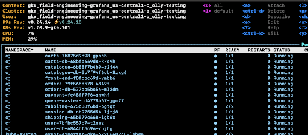
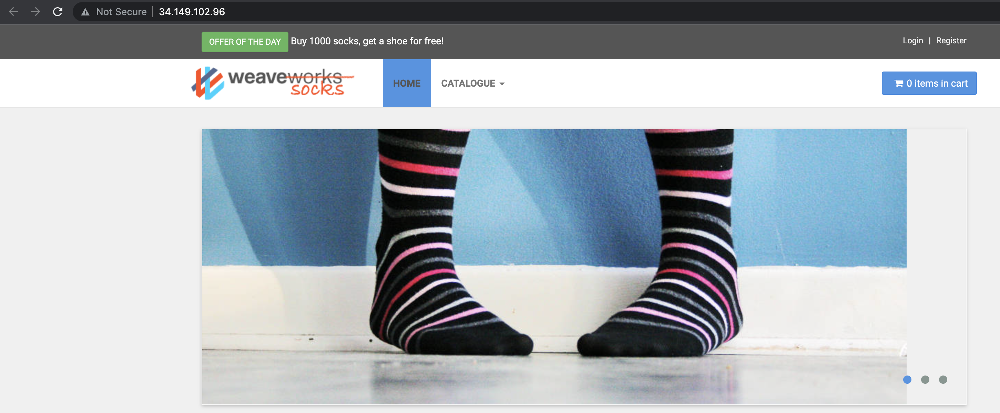

# Breakout 1 - Set up the Lab Environment

In this lab you will:
- Verify your web terminal access
- Verify your Grafana Cloud access
- Deploy the sample application

## I. Verify web terminal access


A. Log into the web terminal. All files for the workshop have been put here and we will be using it as a place to run kubectl commands. This URL and the credentials will be given to you by your instructor. It will look something like:

```
https://<workshopName>.work-shop.grafana.net
```

B. For this workshop, you will be working in your own, individual Kubernetes cluster. In your home directory, you will find a file `$HOME/.kube/config` which has been pre-configured with the details of your own cluster. Try running this command to list the nodes in your cluster:

```shell
kubectl get nodes
```

If you see an error, then run this command to tell kubectl where your kubeconfig file is located, and try again:

```shell
export KUBECONFIG=$HOME/.kube/config
```

## II. Validate that you can log in to Grafana

<br>
A Grafana Cloud stack has been provisioned for you for this workshop. In this section we will validate that we can log into the instance.

<br>

A. Put your grafana stack URL into a browser. This will be:

```
https://<yourloginname>.grafana.net
```

If you logged into the web terminal with `karthik`, then your url will be `https://karthik.grafana.net`.

B. On the login screen, use the same username password that you did for the web terminal. Validate that you see the Grafana home screen.

<br>

**The first time you log in it might take a few seconds**

## III. Ensure the Sample Application is running

For the rest of the workshop, we will be using [Weaveworks Sockshop](https://microservices-demo.github.io/).

**Note:** For some workshops, the sample application may have been deployed for you already. Your instructor will give you details.

A. Go to your home directory in the web terminal (`cd ~`), then run the following command to deploy the sample application:

```shell
kubectl apply -n default -f application/sockshop-demo-app.yaml
```

The application may take up to 20 minutes to become available, while a new SSL certificate is issued by the cloud provider.

B. To watch the progress of the application deployment, run k9s in the web terminal:

```shell
k9s
```



You can inspect the status of the application's SSL certificate by typing `:managedcertificate` and pressing Enter.

You can exit the k9s application by using `Ctrl-C` or typing `:quit<Enter>`.

C. When everything is up, you should be able to reach the application via an HTTPS URL that has been created. Your URL is:

```
https://<my-login-name>.work-shop.grafana.net
```



That's it! You successfully deployed the sample application.
