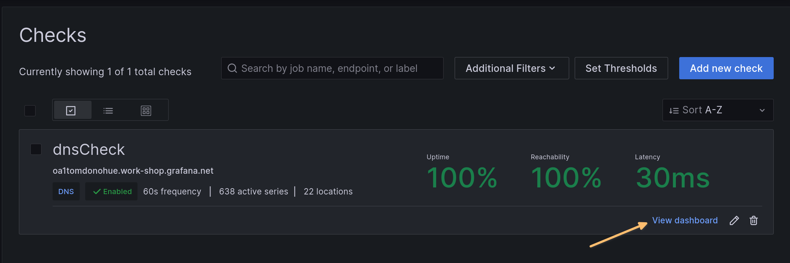
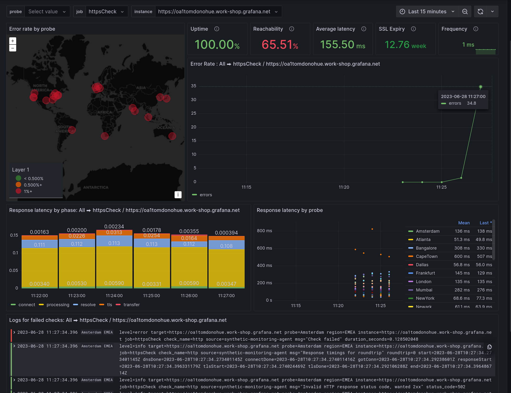

# Breakout 2 - Blackbox monitoring

In this section, you will set up black box monitoring for the front-end of the application.

A. Go to your Grafana Dashboard. If you've lost the window, your URL is:

```
https://<my-login-name>.grafana.net
```

And your password is the same as the password for the web terminal.

B. Click the menu button (☰) at the top left, expand _Observability_ and click _Synthetics_.


C. When the Synthetics homepage opens, scroll down and click on the `Initialize the plugin` button to get started.


D. After initialization, from the menu bar at the left, choose _Synthetics &rarr; Checks_.

E. The first check we will set up is a DNS check. Click on `New Check`


F. Fill in values:
- Choose `DNS` as the check type
- For `Job Name`, enter `dnsCheck`
- For `Target` enter the domain name for your sockshop front end application. This looks like `<myname>.work-shop.grafana.net`.
- Under `Probe Locations` choose `All` to populate the locations box.
- Accept all other defaults, scrolling to the bottom of the page and selecting 'Save'.


When you save, you will be taken back to the home page for Synthetics Monitoring. Because the check has not had time to fire yet, you will see "N/A" for most of the values.

G. Once values start filling in for Uptime and Reachability, click on `View Dashboard` at the bottom right of the entry.



H. When you open the dashboard, you will see the default dashboard for DNS checks. You should see something that looks similar to the following. If you do not, try refreshing your browser:


I. Repeating the same process above, set up an **HTTP** check for the website, accepting defaults for anything you do not see. Again, choose _All_ locations when specifying where your probe is located. Note when giving your application URL, you need to include the `https://` at the front of the URL. (Your URL is `https://<my-login-name>.work-shop.grafana.net`):


J. Open the httpCheck dashboard until you see that it has run a few times. It's a good idea to change the time range in the time picker to 'Last 15 minutes' so that you see a more expanded view.

K. Now we will scale down the front-end service that is serving the web pages. Go to the browser tab with the Web Shell in it and enter the following:

```shell
kubectl scale deployment --replicas=0 front-end
```

You may see a warning about `beta.kubernetes.io/os` being deprecated; this is OK.

L. Verify that the front-end has no more instances running:

```shell
$ kubectl get deployments
NAME           READY   UP-TO-DATE   AVAILABLE   AGE
...
front-end      0/0     0            0           47h
...
```

M. Go back to the httpCheck dashboard and see that the check is now failing. Notice that you can see the associated log lines with the failed checks at the bottom.



N. Scale the front-end back up to one replica via the Web Shell, and make sure that you see successes starting to go through via the httpCheck dashboard:

```shell
kubectl scale deployment --replicas=1 front-end
```

O. Verify that the front-end is back up - you should eventually see `1/1` in the READY column:

```shell
$ kubectl get deployments
NAME           READY   UP-TO-DATE   AVAILABLE   AGE
...
front-end      1/1     1            1           47h
...
```

And that's the end of the second breakout!