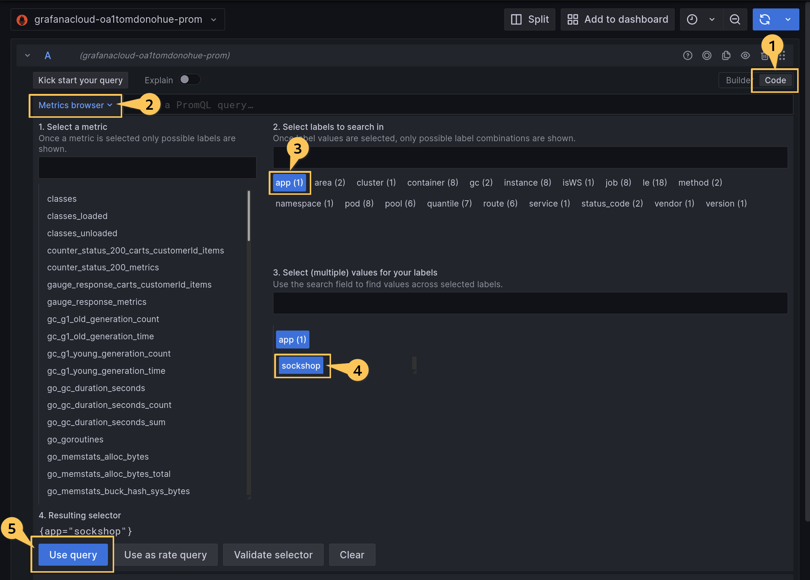
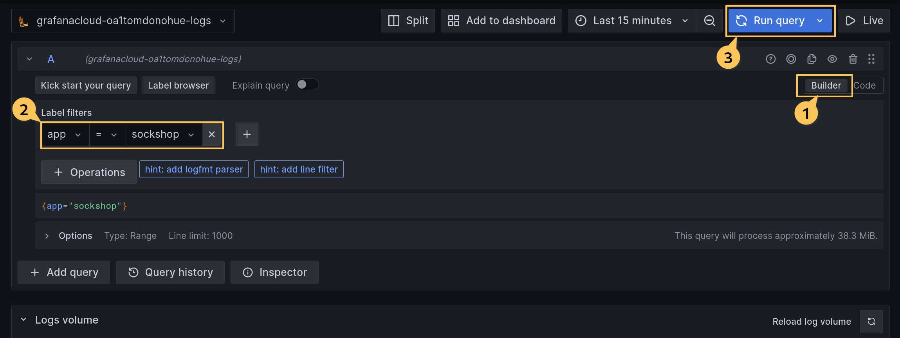
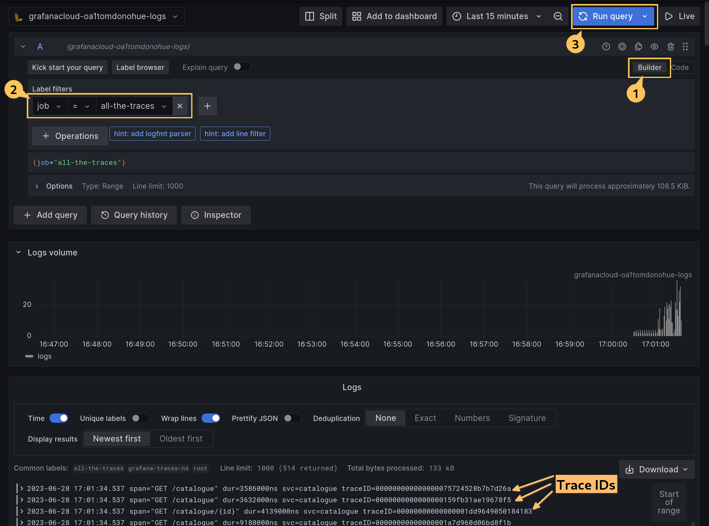
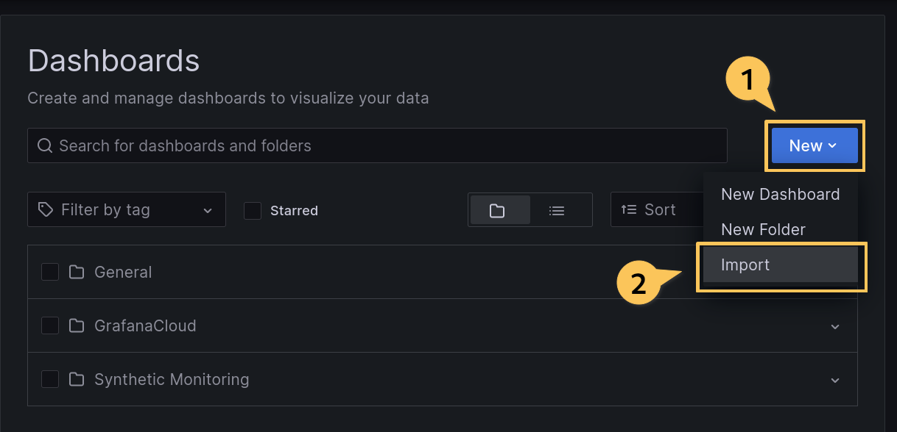
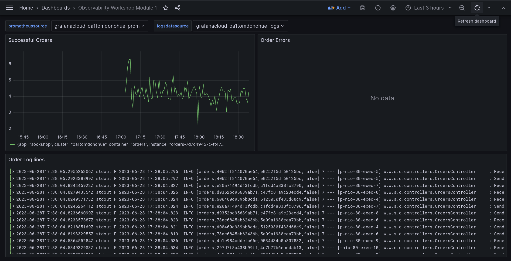

# Breakout 3 - Configuring Grafana Agent for Metrics, Logs, and Traces

## I. Deploy the Metrics Agent

Now that we've done black box monitoring, we want to set up white box monitoring. To do this, we will install the Grafana Agent and configure it for metrics collection.

A. In your home folder in the web terminal, use `nano` or `vi` or `more` to open `metrics/metrics-agent-deploy.yaml`. If you are not familiar with either `nano` or `vi`, use `more`.
  This Kubernetes manifest will create a Namespace, Deployment, Service Account, ClusterRole and ClusterRoleBinding. You do not need to edit this file, just review what it is doing.

```
more metrics/metrics-agent-deploy.yaml
```

B. Deploy the metrics agent:

```shell
kubectl apply -f metrics/metrics-agent-deploy.yaml
```

C. View that the agent is starting in k9s. If you do not see namespaces other than `default`, type `0` (zero) to view all kubernetes namespaces. You might note that the Grafana Agent pod fails to start, that's OK, we're expecting it!

```shell
k9s
```
Again, exit k9s with either `Ctrl-C` or `:quit<Enter>`.

D. Open `metrics/metrics-agent-cm.yaml` with `nano` or `vi` or `more`. Before the workshop, an API key was already created in your Grafana Cloud instance to be used for sending telemetry. This file has been filled in already with the appropriate credentials prior to the workshop for your Grafana Cloud instance, specifically:

| Line no | Cloud Setting | ConfigMap Setting |
|--|--|--|
|19|Remote Write Endpoint|configs[agent]>remote_write>url|
|21|Username/InstanceID|configs[agent]>remote_write>basic_auth>username|
|22|Password/API Key|configs[agent]>remote_write>basic_auth>password|

Do not edit the file. Just review it.

E. Deploy the agent ConfigMap.

```shell
kubectl apply -f metrics/metrics-agent-cm.yaml
```

F. Restart the agent so that it picks up the config map settings and starts the pod:
```shell
kubectl rollout restart deployments/grafana-metrics-agent -n grafana-metrics-ns
```

G. Now we need to verify that the data is arriving in Grafana Cloud. From your home Grafana Cloud page, click the menu button (☰) at the top left and choose _Explore_:


H. In the explore window, choose the prom data source for your cloud account. It will show up by default, with a name like grafanacloud-youracctname-prom


I. Click on the _Code_ view button, and then the _Metrics browser_. Let's make sure that your Prometheus instance has been populated with metrics and labels. The sockshop app has a label `app=sockshop`, so click on the _app_ label and the _sockshop_ value. You can see all metrics with that app and value in the list on the left. Click on 'Use query' at the bottom. If you see this label and a list of metrics, this means that the metrics are arriving successfully. If you do not see this label, either ask the instructor, or use k9s to look at the logs for `grafana-metrics-agent`.



## II. Configuring Grafana Agent for Logs

Because promtail (one of the primary means of sending logs to Loki) scrapes logs via the local filesystem, we will be deploying the grafana agent as a daemonset to capture logs. The files for this lab can be found in `logs`.

A. In your home folder in the web terminal, use `nano` or `vi` to open `logs/logs-agent-deploy.yaml`. This will create a Namespace, Deployment, Service Account, ClusterRole and ClusterRoleBinding, similar to the `metrics/metrics-agent-deploy.yaml` file. You do not need to edit this file, just review what it is doing.

B. Deploy the Logs agent:

```shell
kubectl apply -f logs/logs-agent-deploy.yaml
```

C. The logs ConfigMap will tell the logs agent how to behave. The `logs/logs-agent-cm.yaml` for the logs agent has already been filled in with the details of your Grafana Cloud stack, specifically:

|Line no|Cloud Setting|ConfigMap Setting|
|--|--|--|
|7|URL+`/loki/api/v1/push`|configs[clients]>url|
|9|User|configs[clients]>basic_auth>username|
|10|Password/API Key|configs[clients]>basic_auth>password|

The API key is the same one from the metrics lab. They do not need individual keys.

D. Deploy the Logs agent configuration:

```shell
kubectl apply -f logs/logs-agent-cm.yaml
```

E. Restart the logs agent to pick up the values in the ConfigMap.

```shell
kubectl rollout restart daemonset/grafana-logs-agent -n grafana-logs-ns
```

F. Log into your Grafana dashboard instance and go to `Explore`. Choose the data source similarly named to that of the Prometheus one, but suffixed with `-logs`. Ensure that the _Builder_ view is selected, using the button at the top right. You should see several labels appear in the logs browser. If you only see `__name__`, try refreshing after a few minutes. If it is still just the `__name__` label, you will need to troubleshoot your deployment. Use k9s to view logs or speak to your instructor.

G. Make sure that you see a label `app` and a value of `sockshop` and click _Run query_ (the blu) to make sure you are seeing logs. If you see errors in the logs saying that no host could be found for grafana-traces-agent, that's ok. We will fix that next.



## III. Configuring Grafana Agent for Traces

This will start to feel like a familiar process. Now we will install the agent, but configured for traces.

A. Review `traces/traces-agent-deploy.yaml` and deploy it:

```shell
kubectl apply -f traces/traces-agent-deploy.yaml
```

B. Review `traces/traces-agent-cm.yaml`. We have already filled in the details for your Grafana Cloud stack in the files. Specifically:

|Line no|Cloud Setting|ConfigMap Setting|
|--|--|--|
|36|User|traces>configs[batch]>remote_write>basic_auth>username|
|37|API Key (the same one used for logs and metrics)|traces>configs[batch]>remote_write>basic_auth>password|

C. A block at the bottom will send traceIDs to logs. This is also already filled in with the details of your logging instance in Grafana Cloud. This allows the connections from traces to logs. The logs with traces will be associated with the label `job=all-the-traces`.


```yaml
    logs:
      configs:
        - name: cloud-traces
          clients:
            - url: https://<your logs endpoint>/api/v1/push
              basic_auth:
                username: <your logs user>
                password: <your api key>
              external_labels:
                job: all-the-traces
                namespace: grafana-traces-ns
```

D. Deploy the traces ConfigMap

```shell
kubectl apply -f traces/traces-agent-cm.yaml
```

E. Restart the traces agent to pick up the config map settings:

```shell
kubectl rollout restart deployment/grafana-traces-agent -n grafana-traces-ns
```


## IV. Generate load to create traces

A. In the `application` directory, you will find a file called `load-test.yaml`. Open it and review it. This will send requests through the `front-end` service.


B. Deploy the load test :

```shell
kubectl apply -f application/load-test.yaml
```

C. Wait for a few minutes, then open up your Grafana Cloud instance.

D. Go to Explore, and choose your logs data source. Ensure the Using the label drop-down boxes, choose the `job` label and the value `all-the-traces`. Click on the _Run query_ button (top right). This will show you logs lines where traceIDs were recorded. (This was the point of the logs configuration in the traces agent ConfigMap).



E. Click into one of the logs lines with the `>` in the left hand margin and click on the button next to the `traceID` field. This will open up the trace in the right hand panel.


F. The trace will be opened up on the right side of the screen. Some of the more interesting traces are `GET /customers`.


G. If you click on `Logs for this span` and do not find logs, expand the range on the time picker in the menu bar.

## V. Import the Dashboard

Finally, we will import a simple dashboard to show some details of the `orders` pod.

A. Click the menu button (☰) and choose _Dashboards_.

B. From the Dashboards menu, click on _New_ and then click on _Import_.



C. In the _Import via grafana.com_ box, enter `15642` and then click the _Load_ button.


D. At the bottom, choose your logs and metrics data sources from your Grafana Cloud stack, and click the _Import_ button.


E. Finally, load the dashboard. You should see the dashboard populate with data from your logs and metrics data sources. If no errors have occured yet with orders, that panel may be empty.



And that's the end of the final breakout!